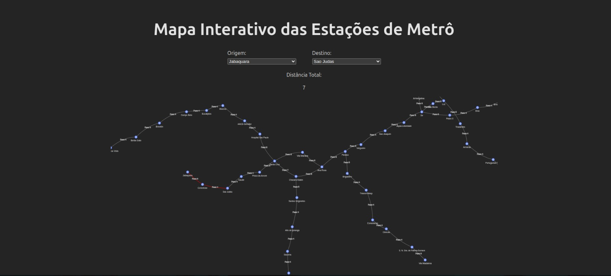

# Metrô SP

**Conteúdo da Disciplina**: Grafos 2<br>

## Alunos
|Matrícula | Aluno |
| -- | -- |
| 19/0087439  |  Gabriel de Souza Fonseca Ribeiro |
| 19/0091606 |  Lucas Caldas Barbosa de Sousa |

## Sobre 
Esse projeto visa aplicar os conceitos de grafos2 ministrados em sala de aula, foi utilizado o algoritmo de dijsktra para calcular o menor caminho entre uma estação de origem e uma de destino. 
## Video de Apresentação
[Apresentação](https://youtu.be/jrdyRPqyZ3U)

## Screenshots


## Instalação 
**Linguagem**: Node Js com Typescript<br>
**Framework**: React<br>


## Uso 
Para poder rodar o projeto é necessário seguir os seguintes passos:
- Instalação do Node
- Clonar o repositório
- Instalar as dependências com o ```yarn install``` ou ```npm i```
- Rodar o projeto com ```npm run dev``` ou ```yarn dev```


